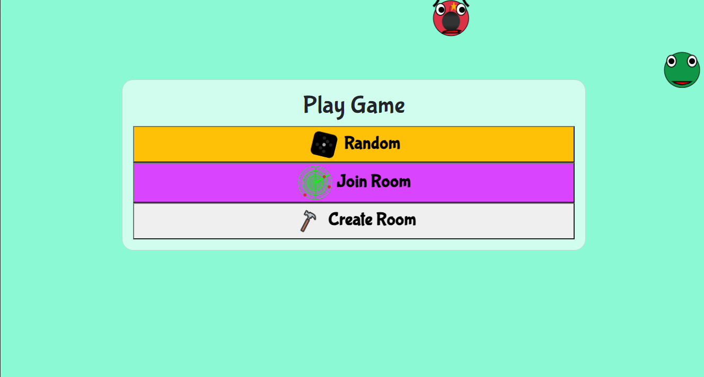
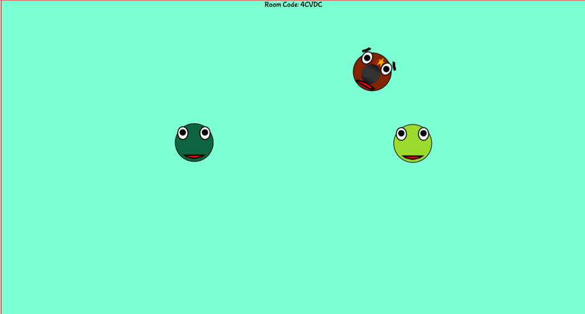

# PassTheBomb

PassTheBomb is a simple multiplayer game made using websockets.

## Todo

- Add sound effects for error messages
- Add svg effect for headphones(mute icon)
- Add a tutorial on how to play the game
- Add tutorial to deploy your own server for backend (Private repo for now)

## Game Images

